# BERG, BERGE, BERGER, BURGER!
<p align="center">

</p>

<p align="center" >
Por vezes hamburgueria e, outras vezes, montanha 🍔 || ⛰️ 
</p>

---

#### [Berg Burger APP](https://bergburger.herokuapp.com/) - Projeto desenvolvido durante o Bootcamp de Desenvolvimento Front-End da SAP006 <LABORATÓRIA>.
---

### ÍNDICE
1. [Definição do Produto](#scroll-definição-do-produto)
2. [Histórias de Usuários](#books-histórias-de-usuário)
3. [Protótipos](#art-protótipos)
4. [Funcionalidades](#crystal_ball-funcionalidades)
5. [Como Utilizar](#woman_technologist-como-utilizar)
6. [Testes de Usabilidade](#raising_hand_woman-testes-de-usabilidade)
7. [Tecnologias utilizadas](#robot-tecnologias-utilizadas)
8. [Estrutura dos Principais Arquivos](#open_file_folder-estrutura-dos-principais-arquivos)
9. [Resultados](#bar_chart-resultados)
10. [Performance, Progressive Web App, Accessibility e Best Practices do Lighthouse](#woman_dancing-performance-progressive-web-app-accessibility-e-best-practices-do-lighthouse)
11. [Sobre a desenvolvedora](#climbing_woman-sobre-a-desenvolvedora)

---

## :scroll: Definição do Produto
<p align='justify'>
O nome Berg une duas grandes paixões da vida: escalada 🧗‍♀️ e a língua neerlandesa 🇳🇱. A palavra Berg em holandês significa montanha e esta, quando soletrada, remete quase que instantaneamente à burger. 
</p>
<p align='justify'>
A Hamburgueria vegetariana Berg, criada em 2021, viu a sua demanda crescer de forma exponencial em poucos meses. As anotações em blocos de papel começaram a dificultar a organização dos funcionários, bem como a dinâmica do restaurante. Neste contexto, surge o desenvolvido com o objetivo de facilitar e padronizar o gerenciamento dos pedidos através da tela de um tablet.
</p>
<p align='justify'>
A primeira Berg Burger APP (BBAPP) está disponível para tablets -- dimensões de 768px ou 1024px -- orientados como retrato ou paisagem, permitindo que o usuário escolha o formato que melhor lhe agrada. No mais, as cores do BBAPP foram selecionadas e aplicadas de forma minuciosa de modo a torná-lo intuitivo e prático.
</p>

No total, 11 telas diferentes compõem o BBAPP e podem ser acessadas conforme o tipo de autenticação de usuárie:
| Tela                       |  Salão | Cozinha | Sem auteticação |
| ---------------------------|:------:|:-------:|:---------------:|
|  Login                     |        |         | X               |
|  Registro                  |        |         | X               |
|  Salão                     | X      |         |                 |
|  Menu                      | X      |         |                 |
|  Novo Pedido               | X      |         |                 |
|  Cozinha                   |        |X        |                 |
|  Pedidos Em Espera         | X      |X        |                 |
|  Pedidos Prontos           | X      |X        |                 |
|  Pedidos Entregues         | X      |X        |                 |
|  Erro 404 (não encontrada) | X      |X        |X                |
|  Erro 401 (não autorizado) | X      |X        |X                |

<p align='justify'>
  As funcionalidades principais do BBAPP envolvem a consulta ao menu personalizado (com preços, ingredientes e suas origens) criação e exclusão de pedidos, visualização do resumo do pedido individual e por mesa, identificçaão de mesas já ocupadas, limpeza de mesas, alteração do status do pedido, filtro de pedidos por status e aquisição de novos pedidos.
</p>

---
## :books: Histórias de Usuário
<div style="display: inline_block" >
  <p align="center">
    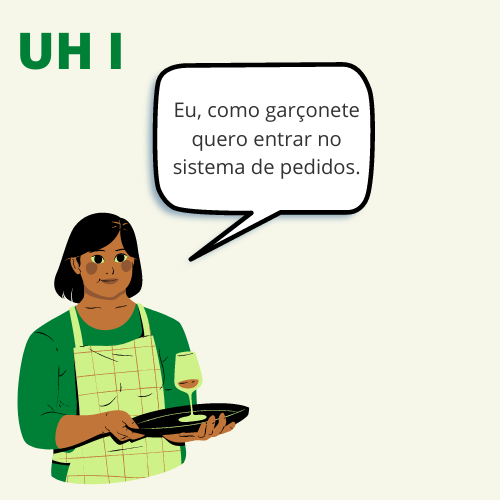
    
    
    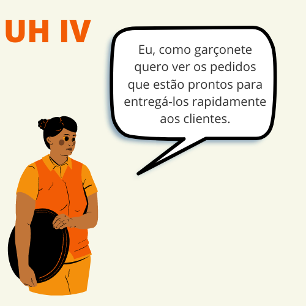
</div>

---
## :art: Protótipos
<p align='justify'>
  As telas do BBAPP seguem o protótipo de alta fidelidade desenvolvido através do Figma. Em se tratando das cores, tons de marrom foram selecionados como base (background e fontes) enquanto que cores simples desempenham função de destaque (status dos pedidos e botões). Destaca-se que todas as ilustrações, bem como o logo, foram criados exclusivamente para este projeto na plataforma Canva.
</p>

<div style="display: inline_block" >
<p align="center">
  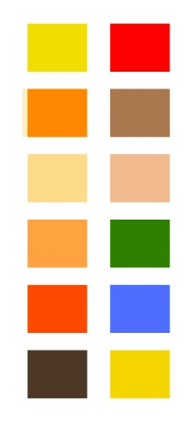
  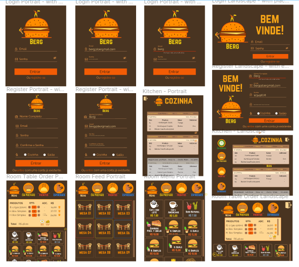
  </p>
</div>

---
## :crystal_ball: Funcionalidades
#### / (login):
 * Entrar com uma conta já existente;
 * Esconder ou mostrar senha;
 * Navegar para a página de registro;
 * Visualizar alerta de erro de autenticação;
 * Ser redirecionado à página principal caso autenticação correta.

#### /register:
 * Criar uma conta;
 * Esconder ou mostrar senha;
 * Navegar para a página de login;
 * Visualizar campos com dados inválidos;
 * Visualizar alerta de erro de autenticação;
 * Ser redirecionado à página principal caso autenticação correta.

#### /room:
 * Visualizar status das mesas (ocupadas ou livres);
 * Visualizar o resumo dos pedidos de cada mesa;
 * Visualizar o valor total (R$) a ser cobrado em cada mesa;
 * Alterar status dos pedidos;
 * Deletar Pedidos;
 * Limpar a mesa (deletar todos os pedidos da mesa);
 * Acessar a página de novo pedido, pedidos em preparo, pedidos prontos e pedidos entregues;
 * Sair da aplicação.

#### /menu:
 * Visualizar itens do cardápio;
 * Filtrar itens de acordo com a categoria;
 * Visualizar informações acerca do produto (ingredientes e respectiva origem);
 * Acessar a página principal, pedidos em preparo, pedidos prontos e pedidos entregues;
 * Sair da aplicação.

#### /neworder:
 * Visualizar itens do cardápio;
 * Filtrar itens de acordo com a categoria;
 * Adicionar produto ao resumo do pedido;
 * Aumentar e/ou diminuitr a quantidade de produtos no resumo do pedido;
 * Deletar produtos no reusmo do pedido;
 * Visualizar valor (R$) total do pedido;
 * Enviar para a cozinha;
 * Receber mensagem caso informações inválidas;
 * Receber mensagem de aviso caso mesa ocupada;
 * Inserir novos pedidos em uma mesa já ocupada;
 * Receber mensagem de sucesso caso pedido enviado à cozinha;
 * Voltar para o salão.
 
#### /kitchen:
* Visualizar todos os pedidos (ordem: pedidos --- mais antigos para mais recentes)
* Carregar novos pedidos;
* Deletar pedidos;
* Acessar a página de pedidos em espera, pedidos prontos e pedidos entregues;
* Sair da aplicação.All-da 

#### /orders/being-prepared:
* Visualizar pedidos que estão em situação de espera (ordem: pedidos --- mais antigos para mais recentes)
* Carregar novos pedidos em situação de espera;
* Apenas funcionários da cozinha podem alterar o status do produto para 'Pronto';
* Acessar a página principal, pedidos prontos e pedidos entregues;
* Sair da aplicação.

#### /orders/ready:
* Visualizar pedidos que estão em situação pronta (ordem: pedidos --- mais antigos para mais recentes)
* Carregar novos pedidos em situação pronta;
* Deletar pedidos;
* Apenas funcionários do salão podem alterar o status do produto para 'Entregue';
* Acessar a página principal, pedidos em preparo e pedidos entregues;
* Sair da aplicação.
 
#### /orders/delivered:
* Visualizar pedidos que estão em situação entregue (ordem: pedidos --- mais recentes para mais antigos)
* Carregar novos pedidos em situação de entregue;
* Deletar pedidos;
* Acessar a página principal, pedidos em preparo e pedidos prontos;
* Sair da aplicação.

#### /wrongadress
* Visualizar mensagem de erro para página não encontrada --- erro 404;

#### /unauthorized
* Visualizar mensagem de erro para página com acesso restrito;
* Voltar para a página principal;
* Sair da aplicação.
 
---
## :woman_technologist: Como Utilizar
<p align='justify'>
  Em primeiro lugar, o usuário deve entrar no sistema do BBAPP. Caso o colaborador ainda não possui conta, este deve se direcionar até a página de registro e criá-la. Na hipótese em que o processo de autenticação encontre um erro, mensagens serão exibidas e os campos com informação inválida serão destacados. O sucesso da autenticação irá redirecionar o usuário para a sua página principal respectiva.
</p>

<p align='justify'>
  Colaboradores do salão terão acesso às páginas de salão, menu, novos pedidos, pedidos em preparo, pedidos prontos e pedidos entregues. Na página de menu e de novo pedido, é possível filtrar os produtos de acordo com as suas categorias. A tabela a seguir apresenta a correspondência dos tipos de produtos:
</p>

  Categoria |  Correspondência   | 
| :--------:|:------------------:|
| Alles     | Todos os produtos  |         
| Snacks    |  Aperitivos        |   
| Burgers   | Hambúrguers        |
| Drinken   | Bebidas            |   
| Morgen    | Café da Manhã      |   
| Dag       | Para o dia         |   
  
 <p align='justify'>
  Na página de menu, ao clicar no símbolo de (+) na imagem de cada produto, um popup com informações acerca dos ingredientes e sua respectiva origem será aberto. É importante ressaltar que todos os hambúrguers produzidos na BERG são baseados em planta e não possuem carne (animal). Além disso, também é possível visualizar o preço e a dispónibilidade de adicionar complementos aos produtos.
</p>

<p align='justify'>
  Na página de novo pedido, as informações a respeito do produto, com exceção do valor (R$), não estão disponíveis. Entretanto, o usuário é capaz de visualizar o sabor e os adicionais disponíveis para cada qual de acordo com a imagem (vaca, galinha, porco e soja -- com ovo, com queijo ou sem adicional). Ao clicar sobre uma imagem, o produto é adicionado diretamente ao carrinho. Neste carrinho, é possível aumentar ou diminuir a quantidade do produto e até mesmo excluí-lo. Destaca-se que o usuário deve inserir o nome do cliente e o número da mesa. Caso a mesa já possua pedidos à ela atrelados, uma mensgaem de alerta é exibida e o usuário poderá escolher entre inserir novos pedidos ou escolher outra mesa. Por fim, no caso de sucesso da operação, o colaborador será informado que as chefs já estão dando conta do pedido.
</p>

<p align='justify'>
  Em se tratando da página principal do salão, o funcionário poderá visualizar o status de cada mesa. Mesas em verde estão livres, ou seja, não possuem pedidos. Por outro lado, as mesas em laranja já possuem ao menos um pedido. Ao clicar em mesas já ocupadas, o usuário irá se deparar com o resumo dos pedidos respectivos à cada mesa. Informações como: número da mesa, nome de cliente, número do pedido, status do pedido, responsável por criar o pedido, tempo decorrido desde a criação do pedido, tempo de duração de cada etapa do ciclo do pedido, quantidade de cada produto, nome do produto, sabor e complemento e valor total do pedido estarão disponíveis. Ainda nesta seção, é possível deletar pedidos (íncone de lixera) e limpar a mesa.
</p>

<p align='justify'>
  Na cozinha é possível visualizar todos os pedidos já realizados (com exceção dos deletados), alterar o status dos pedidos e até excluí-los. Devido ao fato de que todos os status de pedidos estão disponíveis nesta página, aconselha-se es chefs manterem o controle dos pedidos a serem preparados e prontos na página de produos em preparo. As páginas de produtos em preparo, produtos prontos e produtos entregues, permitem a visualização de cada produto pertencente à cada estado respectivo. Nestas facilidades também é possível deletar pedidos e alterar status.
</p>

<p align='justify'>
 Para sair da aplicação, basta clicar no íncone de porta que irá aparecer em quase todas as facilidades.
</p>

---
## :raising_hand_woman: Testes de Usabilidade
 Testes de usabilidade realizados ao decorrer do projeto, com diferentes usuários, apontaram sugestões que foram incorporadas à este produto:
* Indicação da página em que o usuário está;
* Identificação de mesas já ocupadas na página de salão;
* Indicar o período decorrido em cada ciclo do pedido;
* Opção de ordenar os pedidos em ordem crescente ou decrescente (ainda não implementado).
---
## :robot: Tecnologias Utilizadas
<div style="display: inline_block">
  
  
  
  
  
  
  
  
  
  
  
</div>


---
## :open_file_folder: Estrutura dos Principais Arquivos
```
.
├── 📁 src
|   ├── 📁 assets 
|   |   └── 📁 icons
|   |   └── 📁 images
|   |       └── 📁 images-buttons
|   |       └── 📁 images-menu
|   |       └── 📁 images-tables
|   ├── 📁 components
|   |   └── 📁 Button
|   |   └── 📁 CurrentOrder
|   |   └── 📁 ErrorMessages
|   |   └── 📁 Header
|   |   └── 📁 Modal
|   |   └── 📁 Navbar
|   |   └── 📁 NewOrderFilter
|   |   └── 📁 NewOrderTextInput
|   |   └── 📁 OrderHeaderDiv
|   |   └── 📁 OrderListColumn
|   |   └── 📁 OrderTimeSection
|   |   └── 📁 ProductCard
|   |   └── 📁 Table
|   |   └── 📁 UserData
|   ├── 📁 data
|   |   └── 📄 products.js
|   |   └── 📄 tables.js
|   |   └── 📄 titleCorrespondance.js
|   ├── 📁 pages
|   |   └── 📁 auth
|   |   |   └── 📄 Auth.scss
|   |   |   └── 📄 Login.js
|   |   |   └── 📄 Register.js
|   |   └── 📁 kitchen
|   |   |   └── 📄 Kitchen.scss
|   |   |   └── 📄 Kitchen.js
|   |   └── 📁 notFound
|   |   |   └── 📄 NotFound.scss
|   |   |   └── 📄 NotFound.js
|   |   └── 📁 room
|   |   |   └── 📁 menu
|   |   |   |   └── 📄 Menu.scss
|   |   |   |   └── 📄 Menu.js
|   |   |   └── 📁 newOrder
|   |   |   |   └── 📄 NewOrder.scss
|   |   |   |   └── 📄 NewOrder.js
|   |   |   └── 📁 ordersBeingPrepared
|   |   |   |   └── 📄 OrderStatusGeneral.scss
|   |   |   |   └── 📄 OrdersBeingPrepared.js
|   |   |   └── 📁 ordersDelivered
|   |   |   |   └── 📄 OrdersDelivered.js
|   |   |   └── 📁 ordersReady
|   |   |   |   └── 📄 OrdersRady.js
|   |   |   └── 📁 room
|   |   |   |   └── 📄 Room.scss
|   |   |   |   └── 📄 Room.js
|   |   └── 📁 unauthorized
|   |   |   |   └── 📄 Unauthorized.scss
|   |   |   |   └── 📄 Unauthorized.js
|   ├── 📁 routes
|   |   └── 📁 containers
|   |   └── 📁 Root
|   |   └── 📁 utils
|   |   └── 📁 routeComponents
|   |   |   └── 📁 private
|   |   |   └── 📁 public
|   ├── 📁 services
|   |   └── 📄 auth.js
|   |   └── 📄 general.js
|   |   └── 📄 gorders.js
|   |   └── 📄 ordersMath.js
|   |   └── 📄 products.js
|   |   └── 📄 users.js
|   ├── 📁 styles
|   |   └── 📄 Global.scss
|   ├── 📄 history.js
|   ├── 📄 index.js
|   ├── 📄 setupTests.js
├── 📁 node_modules
├── 📁 coverage
├── 📁 public
|   └── 📄 index.html
├── 📄 README.md
├── 📄 package.json

```

---
## :bar_chart: Resultados
#### Landscape
<div style="display: inline_block" >
  <p align="center">
    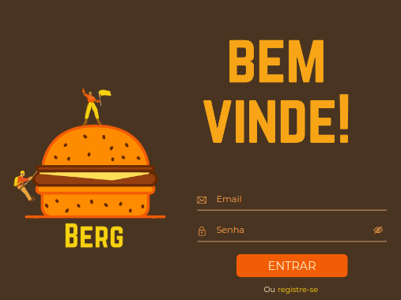
    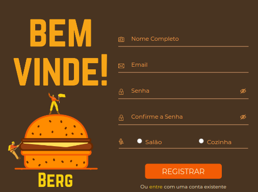
    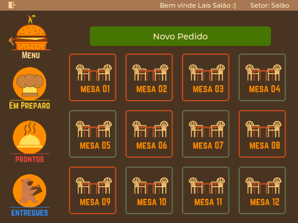
    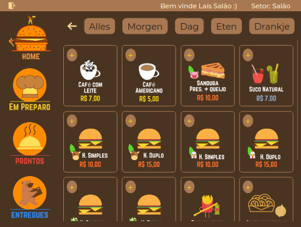
    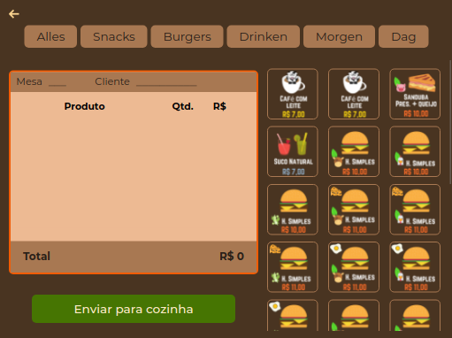
    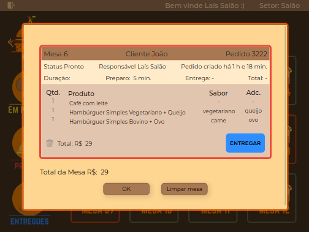
    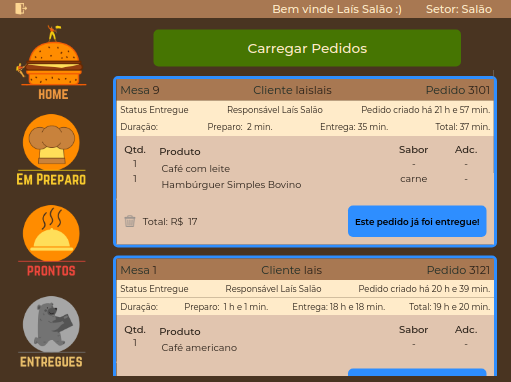
    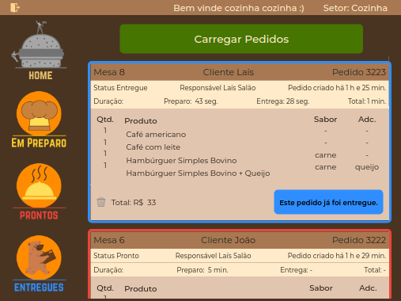
   </p>
</div>

#### Portrait
<div style="display: inline_block" >
  <p align="center">
    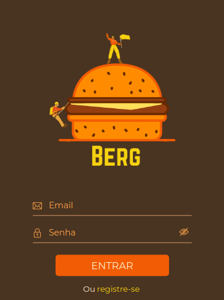
    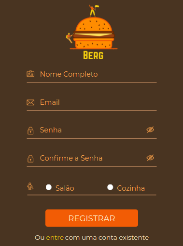
    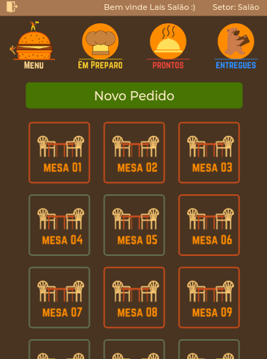
    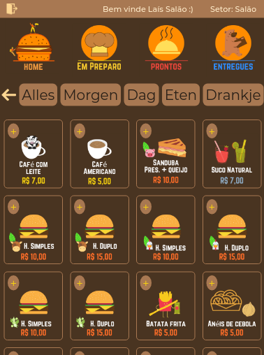
    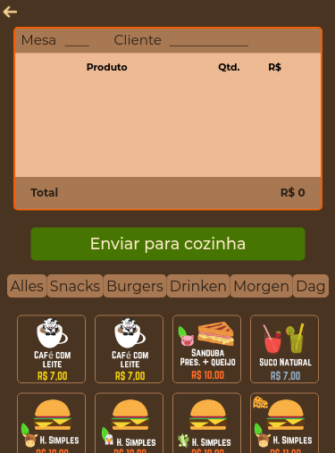
    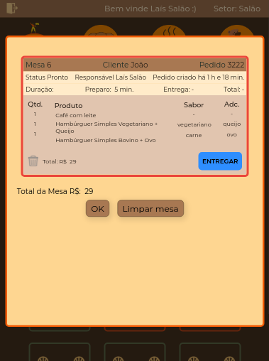
    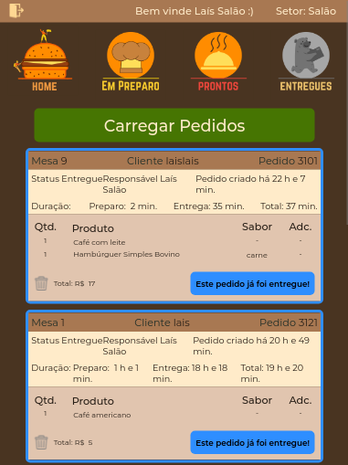
    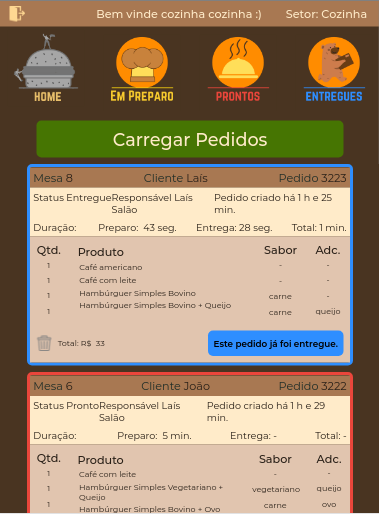
   </p>
</div>

---
## :woman_dancing: Performance, Progressive Web App, Accessibility e Best Practices do Lighthouse
---
## :climbing_woman: Sobre a Desenvolvedora
  <div>
  <a href="https://instagram.com/laisayume" target="_blank"></a>
  <a href="https://www.linkedin.com/in/la%C3%ADs-ayume-lima-mune/" target="_blank"></a> 
  <a href = "mailto:lais.mune@alumni.usp.br"></a>
  <a href = "mailto:aymune@hotmail.com"></a>
  <a href="https://api.whatsapp.com/send?phone=5511989427817" target="_blank"></a>
  </div>
 


